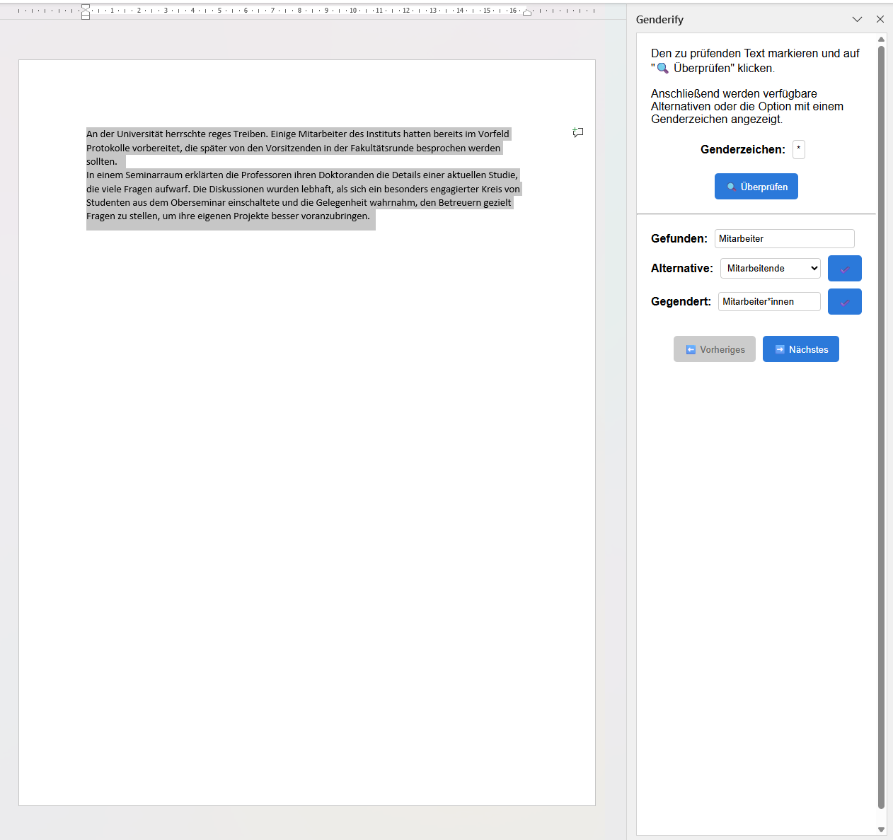
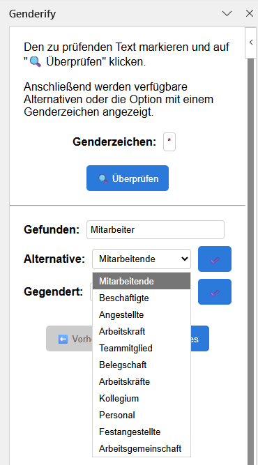

_Genderify_ is a Microsoft Office add-in that aims to support gender-inclusive language in digital documents. The goal of the
project is to provide a simple and effective way to offer gender-neutral alternatives for commonly used terms.

Gender-inclusive language is a crucial step in promoting gender equality in society. Many terms in the German language
are gender-specific and do not reflect the diversity of gender identities. Therefore, it is essential to adapt the
language to address all individuals.

Please be aware, that the vocabulary is not exhaustive and that only suggestions for german terms are provided.
Grammatical rules and contexts are not considered, so it may happen that the sentence structure is no longer correct.
No distinction is made between singular and plural forms with the same spelling.

In addition to the Office add-in, Genderify is also available as an [online tool](https://genderify.vercel.app/).

  
  

  &times;
  

